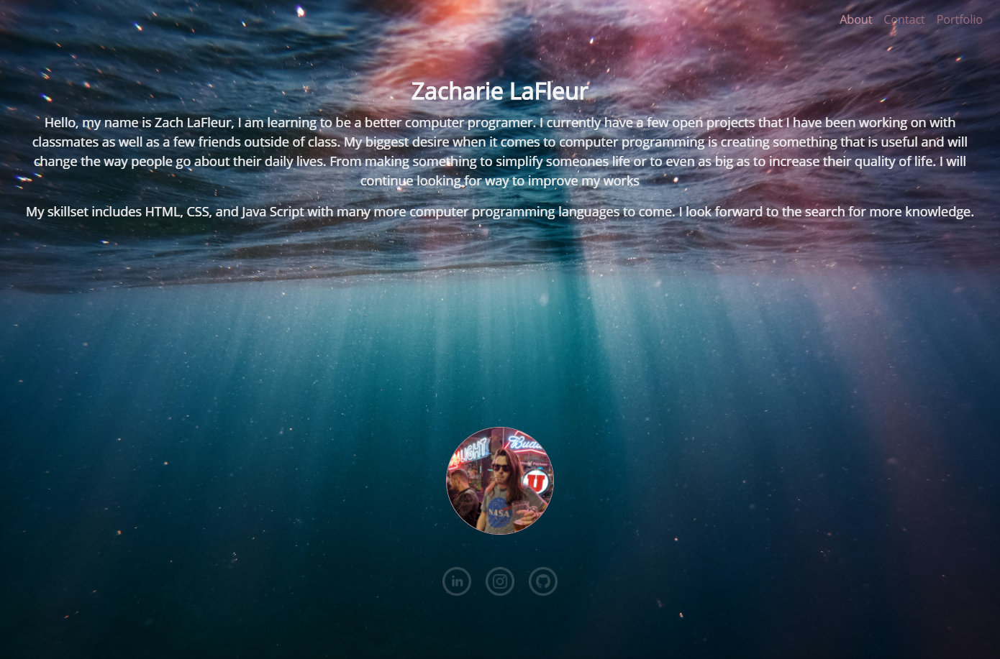

# CSS Bootstrap 

CSS Bootstrap is a repository holding a portfolio for and about Zach LaFleur. It was created using Bootstrap 4.5 as well as CSS and HTML5. It is compatible with small screens and large screens alike.

Bootstrap v4.5 was used in the creation of this portfolio and is linked [here](https://getbootstrap.com/)

Background image was found [here](https://www.pexels.com/)

Stock images were taken from Lorem Picsum and is linked [here](https://picsum.photos/)

This is deployed [here](https://mrcartree.github.io/my-portfoio/)

Authored by [Zach LaFleur](http://github.com/MrCartree)